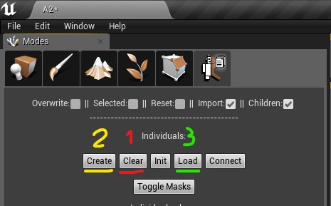
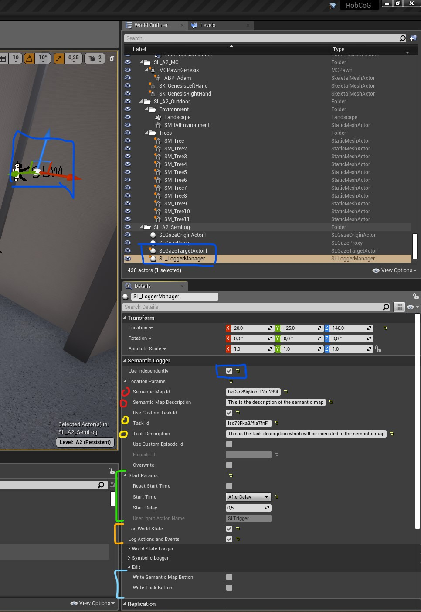

### Setup individuals:

* **1(RED)** clear any existing annotations

* **2(YELLOW)** Create empty individual objects/components

* **3(GREEN)** Annotates indviduals (unique identifiers and class names)

### Example logging using `SLLoggermanager`

* **(BLUE)** add the semantic logger manager to the world, set it up to run on its own (will call independently call Init, Start, Finish)

* **(RED)** annotate your semantic map

* **(YELLOW)** annotate your task

* **(GREEN)** setup your start parameters (start at begin play, after a delay, or wait for user input)

* **(ORANGE)** enable logging raw data (mongoDB) and events (OWL)

* **(LIGHT BLUE)** manual export trigger for the semantic map and task description (editor button hack, just click once and check path: `RobCoG/SL/Maps/`, `RobCoG/SL/Task/`)

