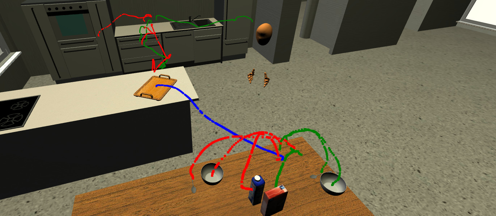
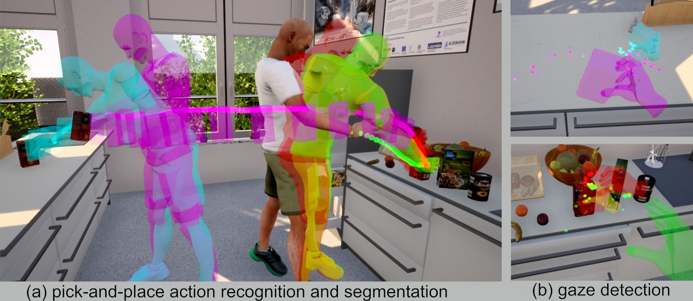

<!----->



# USemLog

Semantic logging plugin for Unreal Engine. Logs symbolic and sub-symbolic data to a KnowRob compatible format.

## Capabilities


# Related publications

```bibtex
@inproceedings{haidu21ameva2,
  title     = {Automated acquisition of structured, semantic models of manipulation activities from human VR demonstration}, 
  author    = {Andrei Haidu and Michael Beetz},
  booktitle = {IEEE International Conference on Robotics and Automation (ICRA)},
  year      = {2021},
  address   = {Xi'an, China},
  url       = {https://arxiv.org/pdf/2011.13689.pdf}
  note      = {Finalist for Best Paper Award on Human-Robot Interaction},
}

@inproceedings{haidu19ameva,
  author    = {Andrei Haidu and Michael Beetz},
  title     = {Automated Models of Human Everyday Activity based on Game and Virtual Reality Technology},
  booktitle = {2019 International Conference on Robotics and Automation (ICRA)},
  year      = {2019},
  pages     = {2606-2612},
  url       = {https://doi.org/10.1109/ICRA.2019.8793859}
}

@inproceedings{haidu18krsim,
  author    = {Andrei Haidu, Daniel Bessler, Asil Kaan Bozcuoglu, Michael Beetz},
  title     = {KnowRob_SIM - Game Engine-Enabled Knowledge Processing Towards Cognition-Enabled Robot Control},
  booktitle = {2018 {IEEE/RSJ} International Conference on Intelligent Robots and Systems, {IROS} 2018, Madrid, Spain, October 1-5, 2018},
  year      = {2018},
  url       = {https://doi.org/10.1109/IROS.2018.8593935}
}
```

# Usage:

#### Include the plugin to your project
* Add the plugin to your project (e.g `MyProject/Plugins/USemLog`)

#### Semantically annotate skeletal components:

* [SkelAnnotationTutorial](Documentation/SkelAnnotationTutorial.md)

#### Proto msgs compilation

* [ProtoMsgs](Documentation/ProtoMsgs.md)

#### CV scan video generation

* [CV_ffmpg](Documentation/CV_ffmpg.md)

#### Semantic logger manager usage

* [SLM](Documentation/SLM.md)

